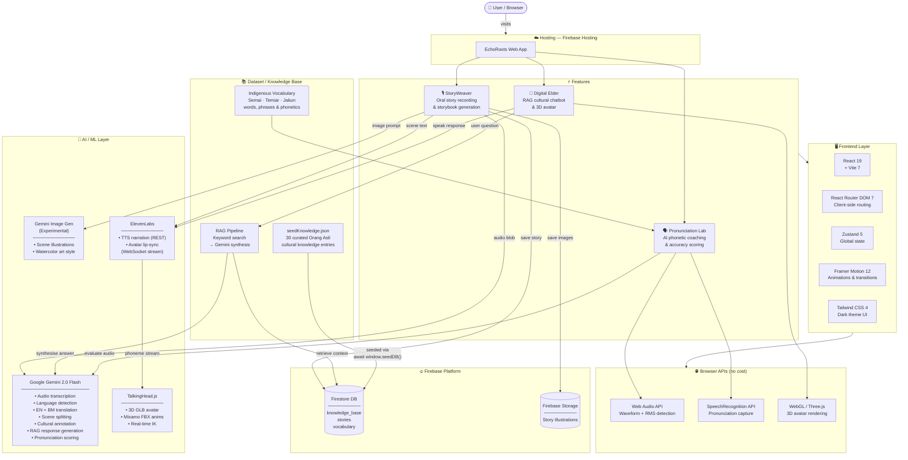

<div align="center">

# 🌿 EchoRoots

### *Preserving the Oral Heritage of Southeast Asian Orang Asli Communities*

**Built for Borneo HackWKND 2026**

---

[](https://react.dev)
[](https://vitejs.dev)
[](https://ai.google.dev)
[](https://firebase.google.com)
[](https://elevenlabs.io)

</div>

---

## 📖 What Is EchoRoots?

EchoRoots is an AI-powered cultural preservation platform built to protect and revitalize the endangered oral traditions of Southeast Asian **Orang Asli** communities — specifically the **Semai**, **Temiar**, and **Jakun** peoples of Peninsular Malaysia.

These communities pass knowledge through spoken word, ceremony, and story. But with fewer than 100,000 speakers across all three groups, and younger generations migrating to cities, these languages face extinction within decades.

EchoRoots bridges that gap with three AI-powered tools:

| Feature | What It Does |
|---|---|
| 🎙 **StoryWeaver** | Record spoken folktales and transform them into illustrated, bilingual digital storybooks |
| 🧙 **Digital Elder** | A RAG-powered AI guardian that answers cultural questions using a verified indigenous knowledge base |
| 🗣 **Pronunciation Lab** | Practice endangered words with AI phonetic coaching and real-time accuracy scoring |

---

## 🏗 Architecture & Tech Stack

### System Architecture Diagram



---

### Layer Breakdown

#### 🖥️ Frontend

| Technology | Version | Role |
|---|---|---|
| React | 19 | UI component framework |
| Vite | 7 | Build tool with HMR |
| Tailwind CSS | 4 | Utility-first styling |
| Framer Motion | 12 | Animations and page transitions |
| React Router DOM | 7 | Client-side routing |
| Zustand | 5 | Global state management |
| Lucide React | latest | Icon library |

#### 🤖 AI / ML

| Service | Model | Purpose |
|---|---|---|
| Google Gemini | gemini-2.0-flash | Transcription, translation, scene splitting, RAG responses, pronunciation evaluation |
| Google Gemini | gemini-2.0-flash-exp-image-generation | Scene illustration generation |
| ElevenLabs | REST + WebSocket | TTS narration and real-time avatar lip-sync |
| TalkingHead.js | — | 3D avatar animation with IK and Mixamo rigs |

#### 🔥 Firebase Platform

| Service | Purpose |
|---|---|
| Firebase Hosting | Static site deployment |
| Firestore | Knowledge base (RAG), story archive, vocabulary |
| Firebase Storage | Story scene illustration images |

#### 🌐 Browser APIs

| API | Purpose |
|---|---|
| Web Audio API + AnalyserNode | Real-time waveform visualization, RMS speech detection |
| SpeechRecognition API | Pronunciation Lab audio capture |
| WebGL / Three.js | 3D Digital Elder avatar rendering |

#### 📚 Dataset

| Source | Contents | Used By |
|---|---|---|
| `src/data/seedKnowledge.json` | 30 curated entries — Semai, Temiar, Jakun traditions, medicine, ceremonies, governance | Digital Elder RAG |
| `src/pages/PronunciationLab.jsx` | 10 indigenous phrases with phonetic guides | Pronunciation Lab |
| Firestore `vocabulary` collection | Indigenous word entries with meanings and cultural context | Future vocabulary expansion |

> **No backend server.** All API calls are made directly from the browser using Vite environment variables (`import.meta.env`). This is intentional for the hackathon prototype.

---

## 🚀 Setup Instructions

### Prerequisites

- Node.js 18+ and npm
- A [Google AI Studio](https://ai.google.dev) account — for Gemini API key
- A [Firebase](https://firebase.google.com) project — Firestore + Storage enabled
- An [ElevenLabs](https://elevenlabs.io) account — for TTS voice synthesis

---

### Step 1 — Clone and Install

```bash
git clone https://github.com/your-repo/echoroots-webapp.git
cd echoroots-webapp
npm install
```

---

### Step 2 — Configure Environment Variables

Create a `.env.local` file in the project root and fill in your keys:

```env
# Google Gemini
VITE_GEMINI_API_KEY=your_gemini_api_key_here

# Firebase
VITE_FIREBASE_API_KEY=your_firebase_api_key
VITE_FIREBASE_AUTH_DOMAIN=your-project.firebaseapp.com
VITE_FIREBASE_PROJECT_ID=your-project-id
VITE_FIREBASE_STORAGE_BUCKET=your-project.appspot.com
VITE_FIREBASE_MESSAGING_SENDER_ID=your_sender_id
VITE_FIREBASE_APP_ID=your_app_id
VITE_FIREBASE_MEASUREMENT_ID=G-XXXXXXXXXX

# ElevenLabs
VITE_ELEVENLABS_API_KEY=your_elevenlabs_api_key
VITE_ELEVENLABS_VOICE_ID=your_voice_id
```

> **Where to find each key:**
> - **Gemini** — [ai.google.dev](https://ai.google.dev) → Get API Key
> - **Firebase** — Firebase Console → Project Settings → Your apps → Web app config
> - **ElevenLabs** — [elevenlabs.io](https://elevenlabs.io) → Profile → API Keys

---

### Step 3 — Firebase Setup

1. Open [Firebase Console](https://console.firebase.google.com) → your project
2. Navigate to **Firestore Database** → **Create database** → select **Test mode** → region `asia-southeast1`
3. Go to the **Rules** tab, paste the following, and click **Publish**:

```
rules_version = '2';
service cloud.firestore.beta {
  match /databases/{database}/documents {
    match /{document=**} {
      allow read, write: if true;
    }
  }
}
```

4. Wait approximately **60 seconds** for the rules to propagate

---

### Step 4 — Start the Development Server

```bash
npm run dev
```

The app runs at **http://localhost:5173**

---

### Step 5 — Seed the Knowledge Base *(required for Digital Elder)*

1. Open the app in your browser
2. Open browser DevTools (`F12`) → **Console** tab
3. Run the following command:

```js
await window.seedDB()
```

4. Wait for the confirmation message: `Seeding finished. Items added: 30`

The Digital Elder is now powered by **30 verified cultural knowledge entries** covering Semai, Temiar, and Jakun traditions, language, medicine, and ceremonies.

---

### Step 6 — Production Build *(optional)*

```bash
npm run build
npm run preview
```

---

## 🤖 AI Disclosure

EchoRoots is an AI-assisted application. Below is a complete disclosure of every AI system in use.

---

### Google Gemini 2.0 Flash

Used for all language understanding and reasoning tasks:

| Task | Description |
|---|---|
| Audio transcription | Multimodal audio input, verbatim word-for-word transcription of indigenous speech |
| Language detection | Identifies Semai, Temiar, Jakun, Malay, or English from audio content |
| Bilingual translation | Translates to English and Bahasa Melayu simultaneously |
| Scene splitting | Divides stories into narrative scenes, proportional to story length |
| Cultural annotation | Generates cultural context notes for each storybook scene |
| Image prompting | Creates culturally sensitive illustration descriptions per scene |
| RAG response generation | Synthesises answers from retrieved Firestore knowledge entries |
| Pronunciation evaluation | Scores speech attempts and returns phonetic coaching tips |

### Gemini Experimental Image Generation

- **Scene illustrations** — Generates original artwork for each storybook scene using culturally contextual prompts

### ElevenLabs

- **Scene narration** (REST API) — Text-to-speech audio for each storybook page
- **Avatar lip-sync** (WebSocket streaming) — Real-time phoneme streaming to drive 3D avatar mouth movements

### TalkingHead.js + Three.js

- **3D Digital Elder avatar** — WebGL-rendered avatar with Mixamo animation rig and real-time lip-sync driven by ElevenLabs audio stream

### Firebase

- **Firestore** — Stores 30 curated knowledge entries for RAG retrieval, persists completed storybooks, and holds vocabulary entries
- **Storage** — Hosts story illustration images

### Browser APIs *(no external AI)*

- **Web Audio API** — Real-time waveform visualization and RMS amplitude-based speech presence detection
- **SpeechRecognition API** — Browser-native speech capture for pronunciation comparison

> All Digital Elder responses are grounded in the curated Firestore knowledge base. The AI is explicitly prompted to avoid hallucination by only synthesising from retrieved context.

---

## 🧭 How to Interact with EchoRoots

### Home Page (`/`)

- Explore the platform overview, feature cards, and pipeline explanation
- Click any feature card or navbar link to jump to a tool

---

### 🎙 StoryWeaver (`/storyweaver`)

**Purpose:** Record an oral story and transform it into an illustrated bilingual storybook.

**How to use:**

1. Select the **tribe and language** of the story (Semai, Temiar, or Jakun)
2. Click the **microphone button** to begin recording
3. Tell your story out loud — speak naturally for at least 3 seconds
4. Click **Stop** when finished
5. The AI pipeline runs automatically through these stages:
   - Transcribes your speech verbatim
   - Detects language and translates to English and Bahasa Melayu
   - Splits the story into narrative scenes
   - Generates culturally contextual artwork per scene
   - Narrates each scene with an ElevenLabs voice
6. Your completed storybook appears in the built-in e-book viewer
7. The story is auto-saved to the **Library** tab after 3 seconds

**Tips:**
- The **primary use case** is an Orang Asli speaker recording in their native Semai, Temiar, or Jakun language — that is what this platform is built for
- Gemini automatically detects whichever language is spoken, so **English and Bahasa Melayu also work** for judges who want to test the pipeline without knowing an indigenous language
- Speak clearly at a natural pace
- The full pipeline takes 30–90 seconds depending on story length

---

### 🧙 Digital Elder (`/digital-elder`)

**Purpose:** Ask questions about Orang Asli culture, traditions, language, and heritage. Receive answers from a 3D AI guardian backed by a verified knowledge base.

**How to use:**

1. Wait for the 3D avatar to load (approximately 5 seconds)
2. Type a question in the chat input and press **Enter** or click **Send**
3. The Elder responds with culturally grounded knowledge
4. **Gold-highlighted words** in responses are indigenous vocabulary terms — hover to see meanings and pronunciations
5. Click the **speaker icon** to hear the Elder speak the response aloud
6. The 3D avatar lip-syncs to the voice in real time

---

### 🗣 Pronunciation Lab (`/pronunciation-lab`)

**Purpose:** Practice pronouncing endangered Orang Asli words with AI phonetic coaching and accuracy scoring.

**How to use:**

1. A word or phrase appears with its English meaning and phonetic guide (e.g., `SEH-mah NYEN`)
   - **UPPERCASE syllables** = stressed
   - **lowercase syllables** = unstressed
2. Press the **microphone button** and pronounce the phrase clearly
3. Press **Stop** when done
4. Click **Evaluate** — Gemini scores your pronunciation (0–100) with specific improvement tips
5. Use the **arrow buttons** to navigate between words
6. Your **streak counter** tracks consecutive successful attempts

---

## 🎬 Judge's Testing Guide

### Quick Start Checklist

- [ ] Run `npm run dev` and open `http://localhost:5173`
- [ ] Run `await window.seedDB()` in browser console (required for Digital Elder)
- [ ] Test **Digital Elder** first — fastest to demo
- [ ] Test **Pronunciation Lab** — no API calls needed for browsing phrases
- [ ] Test **StoryWeaver** with one of the example sentences below

---

### Recommended Test Sentences for StoryWeaver

Speak any of these into your microphone after clicking Record.

> **Note for judges:** StoryWeaver is designed for Orang Asli speakers recording in their native language. If you are an indigenous speaker, record freely in Semai, Temiar, or Jakun — the pipeline will transcribe and translate your words. If you are a judge who does not speak an indigenous language, the Bahasa Melayu or English examples below will still demonstrate the full pipeline.

---

**Bahasa Melayu — closest to authentic use case, recommended for judges (~60 seconds):**
> *"Pada zaman dahulu, orang Semai percaya bahawa setiap pokok di hutan mempunyai roh sendiri. Apabila mereka menebang pokok, mereka akan meminta maaf dan mengucapkan terima kasih kepada roh tersebut. Amalan ini diwarisi turun-temurun sebagai tanda hormat kepada alam semula jadi."*

---

**Short English — fast pipeline, good for quick demo (~30 seconds):**
> *"Long ago, in the forest of the Semai people, there lived a wise old man who could speak to the trees. Every morning he walked to the river to give thanks for the water."*

---

**Medium English — 2–3 scenes, recommended (~60 seconds):**
> *"The Temiar shaman entered the forest at midnight carrying only a torch made from tree bark. He had been called by the spirits to heal a sick child in the village. He chanted the ancient songs taught by his grandmother, and by sunrise the fever had broken."*

---

**Full legend — 3–4 scenes, most impressive result (~90 seconds):**
> *"In the beginning, the Orang Asli say, the earth and sky were one. Then the great hornbill spread its wings and pushed them apart, creating space for the forests and rivers. That is why the hornbill is sacred — it carries the weight of creation in its feathers. The elders teach children to never harm a hornbill, for it is our ancestor watching over us."*

---

### Recommended Questions for Digital Elder

Try these in the chat:

```
What is a sewang ceremony?
Tell me about Semai healing plants.
Who is the tok batin in Jakun culture?
What does punan mean?
How do the Temiar communicate with spirits?
What trees are sacred to the Semai?
Tell me about the halaq shaman.
What is the gunik spirit world?
How do the Orang Asli use the kemunting plant?
```

---

### Phrases to Try in Pronunciation Lab

| Phrase | Language | Meaning | Phonetic Guide |
|---|---|---|---|
| Sema nyen? | Semai | What is your name? | SEH-mah NYEN |
| Hay deh! | Temiar | Hello! | HAY DEH |
| Sey noh deh? | Temiar | How are you? | SAY NOH DEH |
| Yok nah | Temiar | I'm going now | YOHK NAH |
| Senroi | Semai | Respect for nature | SEN-ROY |
| Tolak bala | Semai | Ward off evil | TOH-lahk BAH-lah |
| Naah | Semai | One | NAH |
| Baar | Semai | Two | BAR |

---

## 📁 Project Structure

```
echoroots-webapp/
├── public/
│   ├── talkinghead/          # TalkingHead.js 3D avatar library
│   ├── models/               # GLB avatar model file
│   └── animations/           # Mixamo FBX animation files
├── src/
│   ├── components/
│   │   ├── home/             # Landing page section components
│   │   ├── AudioRecorder.jsx # Web Audio API recording with waveform
│   │   ├── EBookViewer.jsx   # Paginated storybook viewer
│   │   ├── Navbar.jsx
│   │   └── Footer.jsx
│   ├── data/
│   │   └── seedKnowledge.json  # 30 curated Orang Asli knowledge entries
│   ├── hooks/
│   │   ├── useAudioRecorder.js     # Recording, waveform, speech detection
│   │   ├── useStoryPipeline.js     # Pipeline orchestration + Zustand bridge
│   │   └── useSpeechRecognition.js # Browser SpeechRecognition wrapper
│   ├── pages/
│   │   ├── Home.jsx
│   │   ├── StoryWeaver.jsx
│   │   ├── DigitalElder.jsx
│   │   └── PronunciationLab.jsx
│   ├── services/
│   │   ├── gemini.js         # All Gemini API calls
│   │   ├── rag.js            # RAG: Firestore vector/keyword search
│   │   ├── storyPipeline.js  # StoryWeaver multi-stage orchestrator
│   │   ├── elevenlabs.js     # TTS REST + WebSocket streaming
│   │   ├── avatar.js         # TalkingHead.js wrapper
│   │   └── firebase.js       # Firebase Firestore + Storage init
│   ├── stores/
│   │   └── appStore.js       # Zustand global state
│   └── utils/
│       └── vocabParser.js    # Parses [word|meaning] inline vocab format
├── .env.local                # API keys — not committed to version control
└── README.md
```

---

## ⚠️ Known Limitations

| Limitation | Detail |
|---|---|
| Embedding vectors | Gemini `embedding-001` requires separate API quota. The knowledge base uses keyword search as fallback — Digital Elder still functions correctly. |
| 3D avatar | Requires WebGL browser support. Gracefully degrades to a flat chat UI if WebGL is unavailable. |
| Image generation | Gemini image generation is experimental and subject to rate limits. A placeholder is shown on failure. |
| ElevenLabs TTS | Requires a valid API key with remaining character quota. Falls back to browser SpeechSynthesis automatically. |
| Client-side API keys | Keys are in the browser bundle — intentional for hackathon prototype. Production deployment would require a backend proxy. |

---

## 🌏 Cultural Acknowledgement

EchoRoots was built with deep respect for the **Semai**, **Temiar**, and **Jakun** peoples of Peninsular Malaysia. All cultural knowledge used in this platform is drawn from publicly available anthropological and linguistic research. We acknowledge that no technology can replace the richness of lived cultural transmission. EchoRoots exists only to support and amplify the preservation efforts of these communities — never to appropriate or commercialise their heritage.

---

<div align="center">

*"Every word, every whispered story, every cultural tradition deserves to echo through time."*

**EchoRoots · Borneo HackWKND 2026**

</div>
