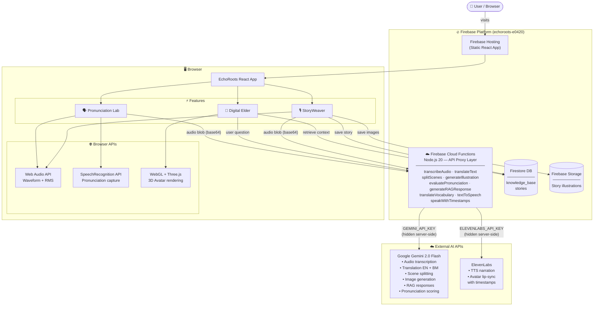

<div align="center">

# 🌿 EchoRoots: Echoing Ancestral Voices into the Digital Future

### *Preserving the Oral Heritage of Southeast Asian Orang Asli Communities*

---

### 🔗 Links

| | |
|---|---|
| 🌐 **Live Prototype** | [echoroots-e0420.web.app](https://echoroots-e0420.web.app) |
| 🎬 **Pitch + Demo Video Link** | [youtu.be/y2yLZajA4yw](https://youtu.be/y2yLZajA4yw) |
| 📄 **Project Report** | [View on Google Drive](https://drive.google.com/file/d/15Uwjq20wp0jmJIyUPtmd3YegqZ83oMKE/view?usp=sharing) |
| 📊 **Presentation Slides** | [View on Google Drive](https://drive.google.com/file/d/1LTKPLd9EitI9VoMRNP1fixHp_Oe8CFTj/view?usp=sharing) |

---

[](https://react.dev)
[](https://vitejs.dev)
[](https://ai.google.dev)
[](https://firebase.google.com)
[](https://elevenlabs.io)

</div>

---

## 📖 What Is EchoRoots?

EchoRoots is an AI-powered cultural preservation platform built to protect and revitalize the endangered oral traditions of Southeast Asian **Orang Asli** communities — specifically the **Semai**, **Temiar**, and **Jakun** peoples of Peninsular Malaysia.

These communities pass knowledge through spoken word, ceremony, and story. But with fewer than 100,000 speakers across all three groups, and younger generations migrating to cities, these languages face extinction within decades.

EchoRoots bridges that gap with three AI-powered tools:

| Feature | What It Does |
|---|---|
| 🎙 **StoryWeaver** | Record spoken folktales and transform them into illustrated, trilingual digital storybooks |
| 🧙 **Digital Elder** | A RAG-powered AI guardian that answers cultural questions using a verified indigenous knowledge base |
| 🗣 **Pronunciation Lab** | Practice endangered words with AI phonetic coaching and real-time accuracy scoring |

---

## 🏗 Architecture & Tech Stack

### System Architecture Diagram



> **Security design:** The browser never touches Gemini or ElevenLabs directly. All AI calls are proxied through Firebase Cloud Functions where API keys are stored in Google Secret Manager — invisible to anyone inspecting browser DevTools.

---

### Layer Breakdown

#### 🖥️ Frontend

| Technology | Version | Role |
|---|---|---|
| React | 19 | UI component framework |
| Vite | 7 | Build tool with HMR |
| Tailwind CSS | 4 | Utility-first styling |
| Framer Motion | 12 | Animations and page transitions |
| React Router DOM | 7 | Client-side routing |
| Zustand | 5 | Global state management |
| Lucide React | latest | Icon library |

#### ☁️ Backend — Firebase Cloud Functions

| Function | Purpose |
|---|---|
| `transcribeAudio` | Receives base64 audio, calls Gemini multimodal, returns verbatim transcription + language |
| `translateText` | Translates indigenous text to English and Bahasa Melayu simultaneously |
| `splitScenes` | Divides story into narrative scenes with per-scene translations and image prompts |
| `generateIllustration` | Generates watercolor scene artwork via Gemini Image Gen (3-provider fallback chain) |
| `evaluatePronunciation` | Scores pronunciation attempt 0–100 with phonetic coaching tips |
| `generateRAGResponse` | Synthesises culturally grounded answers from retrieved Firestore knowledge entries |
| `translateVocabulary` | Handles direct vocabulary translation questions (e.g., "What is eat in Semai?") |
| `textToSpeech` | ElevenLabs REST TTS for story narration — returns base64 audio |
| `speakWithTimestamps` | ElevenLabs TTS with character-level alignment for 3D avatar lip-sync |

#### 🤖 AI / ML

| Service | Model | Purpose |
|---|---|---|
| Google Gemini | `gemini-2.0-flash` | Transcription, translation, scene splitting, RAG responses, pronunciation evaluation |
| Google Gemini | `gemini-2.0-flash-exp-image-generation` | Scene illustration generation (free tier) |
| Google Gemini | `imagen-4.0-fast-generate-001` | Illustration fallback provider 2 (Blaze plan) |
| Google Gemini | `imagen-4.0-generate-001` | Illustration fallback provider 3 (Blaze plan) |
| ElevenLabs | `eleven_multilingual_v2` | TTS narration and avatar lip-sync with word-level timestamps |
| TalkingHead.js | — | 3D avatar animation with IK rig and real-time lip-sync |

#### 🔥 Firebase Platform

| Service | Purpose |
|---|---|
| Firebase Hosting | Static site deployment (React build output) |
| Firebase Cloud Functions | Node.js 20 serverless API proxy — keeps AI keys hidden |
| Firestore | Knowledge base (RAG), story archive |
| Firebase Storage | Persistent story scene illustration images |
| Secret Manager | Secure storage for `GEMINI_API_KEY` and `ELEVENLABS_API_KEY` |

#### 🌐 Browser APIs

| API | Purpose |
|---|---|
| Web Audio API + AnalyserNode | Real-time waveform visualization, RMS amplitude-based speech detection |
| SpeechRecognition API | Browser-native speech capture for Pronunciation Lab |
| WebGL / Three.js | 3D Digital Elder avatar rendering |

#### 📚 Dataset

| Source | Contents | Used By |
|---|---|---|
| `src/data/seedKnowledge.json` | 98 curated entries — Semai, Temiar, Jakun, Batek, Mah Meri, Che Wong traditions, medicine, ceremonies, governance, language, folklore | Digital Elder RAG |
| `src/pages/PronunciationLab.jsx` | 10 indigenous phrases with phonetic guides | Pronunciation Lab |
| Firestore `vocabulary` collection | Indigenous word entries with meanings and cultural context | Future vocabulary expansion |

---

## 🚀 Setup Instructions

### Prerequisites

- Node.js 18+ and npm
- [Firebase CLI](https://firebase.google.com/docs/cli) — `npm install -g firebase-tools`
- A [Google AI Studio](https://ai.google.dev) account — for Gemini API key
- A [Firebase](https://firebase.google.com) project on the **Blaze (pay-as-you-go)** plan — required for Cloud Functions outbound requests
- An [ElevenLabs](https://elevenlabs.io) account — for TTS voice synthesis

---

### Step 1 — Clone and Install

```bash
git clone https://github.com/HAIZ4D/echoroots_webapp.git
cd echoroots_webapp
npm install
npm install --prefix functions
```

---

### Step 2 — Configure Environment Variables

Create a `.env.local` file in the project root. Only Firebase config keys go here — **Gemini and ElevenLabs keys are stored securely in Firebase Secret Manager (Step 4), not here.**

```env
# Firebase (public config — safe to include)
VITE_FIREBASE_API_KEY=your_firebase_api_key
VITE_FIREBASE_AUTH_DOMAIN=your-project.firebaseapp.com
VITE_FIREBASE_PROJECT_ID=your-project-id
VITE_FIREBASE_STORAGE_BUCKET=your-project.firebasestorage.app
VITE_FIREBASE_MESSAGING_SENDER_ID=your_sender_id
VITE_FIREBASE_APP_ID=your_app_id
VITE_FIREBASE_MEASUREMENT_ID=G-XXXXXXXXXX

# ElevenLabs voice ID (Bella — free tier compatible female voice)
VITE_ELEVENLABS_VOICE_ID=EXAVITQu4vr4xnSDxMaL
```

> **Where to find Firebase config:** Firebase Console → Project Settings → Your apps → Web app config

---

### Step 3 — Firebase Setup

1. Open [Firebase Console](https://console.firebase.google.com) → your project
2. Navigate to **Firestore Database** → **Create database** → select **Test mode** → region `asia-southeast1`
3. Go to the **Rules** tab, paste the following, and click **Publish**:

```
rules_version = '2';
service cloud.firestore {
  match /databases/{database}/documents {
    match /{document=**} {
      allow read, write: if true;
    }
  }
}
```

4. Navigate to **Storage** → **Get started** → Test mode → same region
5. Wait approximately **60 seconds** for rules to propagate

---

### Step 4 — Deploy Cloud Functions (keeps API keys secure)

```bash
# Log in and link your project
firebase login
firebase use echoroots-e0420

# Store API keys in Google Secret Manager (never in code)
firebase functions:secrets:set GEMINI_API_KEY
# → paste your Google AI Studio key when prompted

firebase functions:secrets:set ELEVENLABS_API_KEY
# → paste your ElevenLabs key when prompted

# Deploy all 9 Cloud Functions
firebase deploy --only functions
```

This takes 2–3 minutes. Once complete, all Gemini and ElevenLabs calls are proxied through your Cloud Functions — keys are never exposed in the browser.

---

### Step 5 — Start the Development Server

```bash
npm run dev
```

The app runs at **http://localhost:5173**

---

### Step 6 — Seed the Knowledge Base *(required for Digital Elder)*

1. Open the app in your browser
2. Open browser DevTools (`F12`) → **Console** tab
3. Run:

```js
await window.seedDB()
```

4. Wait for: `Seeded 98/98 entries...`

The Digital Elder is now powered by **98 verified cultural knowledge entries** covering Semai, Temiar, Jakun, Batek, Mah Meri, and Che Wong traditions, language, medicine, folklore, and ceremonies.

---

### Step 7 — Production Build *(optional)*

```bash
npm run build
npm run preview
```

---

## 🤖 AI Disclosure

EchoRoots is an AI-assisted application. Below is a complete disclosure of every AI system in use.

---

### Google Gemini 2.0 Flash

Used for all language understanding and reasoning tasks (called server-side via Cloud Functions):

| Task | Description |
|---|---|
| Audio transcription | Multimodal audio input, verbatim word-for-word transcription of indigenous speech |
| Language detection | Identifies Semai, Temiar, Jakun, Malay, or English from audio content |
| Bilingual translation | Translates to English and Bahasa Melayu simultaneously |
| Scene splitting | Divides stories into narrative scenes, proportional to story length |
| Cultural annotation | Generates cultural context notes for each storybook scene |
| Image prompting | Creates culturally sensitive illustration descriptions per scene |
| RAG response generation | Synthesises answers from retrieved Firestore knowledge entries |
| Vocabulary translation | Answers direct indigenous language vocabulary questions |
| Pronunciation evaluation | Scores speech attempts and returns phonetic coaching tips |

### Gemini Experimental Image Generation

- **Scene illustrations** — Generates original watercolor-style artwork for each storybook scene
- **3-provider fallback chain:** Gemini 2.0 Flash Image Gen → Imagen 4 Fast → Imagen 4 Full

### ElevenLabs

- **Scene narration** — Text-to-speech audio for each storybook page (`eleven_multilingual_v2`)
- **Avatar lip-sync** — TTS with character-level timing data to drive 3D avatar mouth movements in real time

### TalkingHead.js + Three.js

- **3D Digital Elder avatar** — WebGL-rendered VRoid avatar with custom bone mapping and real-time lip-sync driven by ElevenLabs audio

### Firebase Cloud Functions

- **API proxy layer** — All Gemini and ElevenLabs calls are routed through Node.js 20 Cloud Functions. API keys are stored in Google Secret Manager and never reach the browser.

### Firebase

- **Firestore** — Stores 98 curated knowledge entries for RAG retrieval, persists completed storybooks
- **Storage** — Hosts story illustration images with permanent download URLs

### Browser APIs *(no external AI)*

- **Web Audio API** — Real-time waveform visualization and RMS amplitude-based speech presence detection
- **SpeechRecognition API** — Browser-native speech capture for pronunciation comparison

> All Digital Elder responses are grounded in the curated Firestore knowledge base. The AI is explicitly prompted to avoid hallucination by only synthesising from retrieved context.

---

## 🧭 How to Interact with EchoRoots

### Home Page (`/`)

- Explore the platform overview, feature cards, and pipeline explanation
- Click any feature card or navbar link to jump to a tool

---

### 🎙 StoryWeaver (`/storyweaver`)

**Purpose:** Record an oral story and transform it into an illustrated trilingual storybook (Original language → Bahasa Melayu → English).

**How to use:**

1. Click the **microphone button** to begin recording
2. Tell your story out loud — speak naturally for at least 3 seconds
3. Click **Stop** when finished
4. The AI pipeline runs automatically through these stages:
   - Transcribes your speech verbatim
   - Detects language and translates to English and Bahasa Melayu
   - Splits the story into narrative scenes
   - Generates culturally contextual artwork per scene
   - Narrates each scene with an ElevenLabs voice
5. Your completed storybook appears in the built-in e-book viewer
6. The story is auto-saved to the **Library** tab after 3 seconds

**Tips:**
- The **primary use case** is an Orang Asli speaker recording in their native Semai, Temiar, or Jakun language
- Gemini automatically detects whichever language is spoken — **English and Bahasa Melayu also work** for judges testing the pipeline
- The full pipeline takes 30–90 seconds depending on story length

---

### 🧙 Digital Elder (`/digital-elder`)

**Purpose:** Ask questions about Orang Asli culture, traditions, language, and heritage.

**How to use:**

1. Wait for the 3D avatar to load (~5 seconds)
2. Type a question and press **Enter** or click **Send**
3. The Elder responds with culturally grounded knowledge
4. **Gold-highlighted words** are indigenous vocabulary terms — hover to see meanings
5. Click the **speaker icon** to hear the Elder speak aloud with 3D lip-sync

---

### 🗣 Pronunciation Lab (`/pronunciation-lab`)

**Purpose:** Practice pronouncing endangered Orang Asli words with AI phonetic coaching.

**How to use:**

1. A phrase appears with its English meaning and phonetic guide (e.g., `SEH-mah NYEN`)
2. Press **microphone** and pronounce the phrase clearly
3. Click **Evaluate** — AI scores your pronunciation (0–100) with specific tips
4. Use arrow buttons to navigate between words

---

## 🎬 Judge's Testing Guide

### Quick Start Checklist

- [ ] Visit the live app: **[https://echoroots-e0420.web.app](https://echoroots-e0420.web.app)**
- [ ] The knowledge base is pre-seeded — **Digital Elder is ready to use immediately**
- [ ] Test **Digital Elder** first — type any question from the list below and press Enter
- [ ] Test **Pronunciation Lab** — browse phrases and try recording one
- [ ] Test **StoryWeaver** — record one of the Semai sentences below to run the full AI pipeline

---

### Recommended Test Sentences for StoryWeaver

> **Note:** These are authentic Semai sentences for judges to record and test the full pipeline — transcription, translation, scene splitting, illustration, and narration.

---

**Semai sentences to speak aloud:**

> *"Eng an cip sekolah. Eng an jug rumah. Cak entoi di dewan."*

**Meaning:** "I go to school. I stay at home. We meet in the hall."

---

Speak these three sentences clearly into the microphone. The pipeline will transcribe them in Semai, translate to English and Bahasa Melayu, split into 3 scenes, generate illustrations, and narrate each scene.

---

### Recommended Questions for Digital Elder

```
What is a sewang ceremony?
Tell me about Semai healing plants.
Who is the tok batin in Jakun culture?
What does punan mean?
How do the Temiar communicate with spirits?
What is eat in Semai?
How do you say thank you in Temiar?
What trees are sacred to the Semai?
```

---

### Phrases to Try in Pronunciation Lab

| Phrase | Language | Meaning | Phonetic Guide |
|---|---|---|---|
| Eng an cip sekolah | Semai | I go to school | ENG an CIP seh-KOH-lah |
| Eng an jug rumah | Semai | I stay at home | ENG an JUG roo-MAH |
| Cak entoi di dewan | Semai | We meet in the hall | CHAK en-TOY dee DEH-wan |
| Sema nyen? | Semai | What is your name? | SEH-mah NYEN |
| Hay deh! | Temiar | Hello! | HAY DEH |
| Sey noh deh? | Temiar | How are you? | SAY NOH DEH |
| Yok nah | Temiar | I'm going now | YOHK NAH |
| Senroi | Semai | Respect for nature | SEN-ROY |
| Tolak bala | Semai | Ward off evil | TOH-lahk BAH-lah |
| Naah | Semai | One | NAH |

---

## 📁 Project Structure

```
echoroots-webapp/
├── functions/                    # Firebase Cloud Functions (Node.js 20)
│   ├── index.js                  # 9 API proxy functions (Gemini + ElevenLabs)
│   └── package.json
├── public/
│   ├── talkinghead/              # TalkingHead.js 3D avatar library
│   ├── models/                   # GLB avatar model file
│   └── animations/               # Mixamo FBX animation files
├── src/
│   ├── components/
│   │   ├── home/                 # Landing page section components
│   │   ├── AudioRecorder.jsx     # Web Audio API recording with waveform
│   │   ├── EBookViewer.jsx       # Paginated trilingual storybook viewer
│   │   ├── StoryCard.jsx         # Library story card with cover image
│   │   ├── StoryReaderOverlay.jsx# Fullscreen story reader modal
│   │   ├── Navbar.jsx
│   │   └── Footer.jsx
│   ├── data/
│   │   └── seedKnowledge.json    # 98 curated Orang Asli knowledge entries
│   ├── hooks/
│   │   ├── useAudioRecorder.js   # Recording, waveform, speech detection
│   │   ├── useStoryPipeline.js   # Pipeline orchestration + Zustand bridge
│   │   └── useSpeechRecognition.js
│   ├── pages/
│   │   ├── Home.jsx
│   │   ├── StoryWeaver.jsx
│   │   ├── DigitalElder.jsx
│   │   └── PronunciationLab.jsx
│   ├── services/
│   │   ├── gemini.js             # Calls Cloud Functions (not Gemini directly)
│   │   ├── elevenlabs.js         # Calls Cloud Functions (not ElevenLabs directly)
│   │   ├── avatar.js             # TalkingHead.js wrapper + lip-sync
│   │   ├── rag.js                # RAG: Firestore keyword search + response gen
│   │   ├── storyPipeline.js      # StoryWeaver multi-stage orchestrator
│   │   ├── storyService.js       # Firestore + Storage CRUD for stories
│   │   └── firebase.js           # Firebase init (db, storage, functions)
│   ├── stores/
│   │   └── appStore.js           # Zustand global state
│   └── utils/
│       └── vocabParser.js        # Parses [word|meaning] inline vocab format
├── .env.local                    # Firebase config only — AI keys NOT stored here
├── firebase.json                 # Firebase Hosting + Functions config
├── .firebaserc                   # Firebase project ID
└── README.md
```

---

## ⚠️ Known Limitations

| Limitation | Detail |
|---|---|
| Embedding vectors | Gemini `embedding-001` requires separate API quota. The knowledge base uses keyword search as fallback — Digital Elder still functions correctly. |
| 3D avatar | Requires WebGL browser support. Gracefully degrades to a flat chat UI if WebGL is unavailable. |
| Image generation | Gemini image generation is experimental and subject to rate limits (15 RPM on free tier). A placeholder is shown on failure. |
| ElevenLabs TTS | Requires a valid API key with remaining character quota. Falls back to browser SpeechSynthesis automatically. |
| Cloud Functions cold start | First call after inactivity may take 2–3 seconds extra. Subsequent calls are fast. |
| Firestore rules | Currently in Test Mode (open read/write). Tighten rules before production deployment. |

---

## 🌏 Cultural Acknowledgement

EchoRoots was built with deep respect for the **Semai**, **Temiar**, and **Jakun** peoples of Peninsular Malaysia. All cultural knowledge used in this platform is drawn from publicly available anthropological and linguistic research. We acknowledge that no technology can replace the richness of lived cultural transmission. EchoRoots exists only to support and amplify the preservation efforts of these communities — never to appropriate or commercialise their heritage.

---

<div align="center">

*"Every word, every whispered story, every cultural tradition deserves to echo through time."*

**🌿 EchoRoots: Echoing Ancestral Voices into the Digital Future**

</div>
